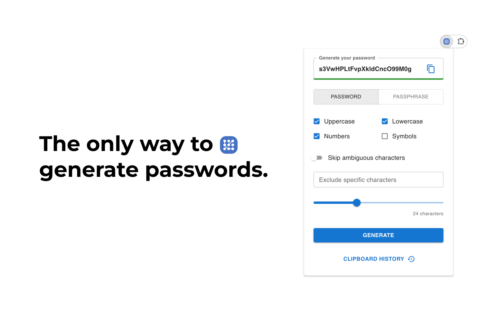

# NovaPass: Password Generator 🔐

Transform your password management experience with NovaPass – a powerful cross-browser extension that combines security with simplicity. Generate strong, customizable passwords right from your browser toolbar.

## Key Features

### Password Generator

- Comprehensive character sets (A-Z, a-z, 0-9, symbols)
- Customizable password length
- Option to skip ambiguous characters
- Exclude specific characters

### Passphrase Generator

- Customizable number of words
- Flexible word separator options
- Word style options: uppercase, lowercase, capitalize
- Optional random number insertion

### Smart History Management

- Local password history tracking
- Quick copy functionality
- Clear history with one click
- Secure storage implementation

### Additional Features

- **Dark mode support**: Automatically syncs with your system preferences

- **Multiple languages support**: English, Arabic, Chinese, French, German, Hindi, Indonesian, Italian, Japanese, Korean, Polish, Portuguese, Russian, Spanish, Thai, Turkish, Ukrainian and Vietnamese

## Installation

NovaPass is available on multiple platforms:

- [Chrome Web Store](https://chrome.google.com/webstore/detail/jpooemhlkehmepkbcbjflhpnjgilellm)
- [Firefox Add-ons](https://addons.mozilla.org/en-US/firefox/addon/novapass)
- [Edge Add-ons](https://microsoftedge.microsoft.com/addons/detail/ibaagiponackkmiicjhggcpdolodebgg)

## Contributing

We welcome contributions to make NovaPass better! Whether you've found a bug, have a feature idea, or want to improve the code - your help is appreciated.

Check our [contribution guidelines](CONTRIBUTING.md) to get started. You can [report bugs](https://github.com/ruslanpashkov/novapass/issues/new?template=bug_report.md), [suggest features](https://github.com/ruslanpashkov/novapass/issues/new?template=feature_request.md), or contribute code by opening [issues](https://github.com/ruslanpashkov/novapass/issues) and [pull requests](https://github.com/ruslanpashkov/novapass/pulls) in our [GitHub repository](https://github.com/ruslanpashkov/novapass). Our [code of conduct](CODE_OF_CONDUCT.md) helps maintain a welcoming environment for everyone.

For code contributions, fork the repository, create a new branch for your work, and submit a pull request. Remember to include tests and update documentation when needed.

## Credits

- [zxcvbn-ts](https://github.com/zxcvbn-ts/zxcvbn) – Low-Budget Password Strength Estimation
- [WXT](https://wxt.dev) – Next-gen Web Extension Framework

## License

This project is open-sourced under the [MIT License](LICENSE).

## Connect

Created by [Ruslan Pashkov](https://github.com/ruslanpashkov)

Have questions or suggestions? We'd love to hear from you!

📧 hi@ruslanpashkov.com

---

If you find NovaPass useful, please consider giving it a ⭐️ on GitHub!

